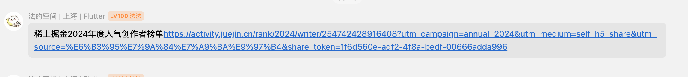

# 使用各种 AI 刷 marscode 的题

包含如下的 prompt 内容：

- cursor
- windsurf
- github copilot
- cline

包含一个 userscript，可以用于复制获取题目的内容

## 你问为什么要刷这个题？

稀土掘金2024年度人气创作者榜单<https://activity.juejin.cn/rank/2024/writer/254742428916408?utm_campaign=annual_2024&utm_medium=self_h5_share&utm_source=%E6%B3%95%E7%9A%84%E7%A9%BA%E9%97%B4&share_token=1f6d560e-adf2-4f8a-bedf-00666adda996>

因为这个刷一题可以多投4票，我顺便测测各种类 copilot 插件/工具的效果

然后，目前得到的情况是

带有agent模式的插件（windsurf、cursor），可以帮助你写出一些基本的代码，并且跑代码根据log来判断对错，修改，但是因为刷题网站给的用例不全，往往需要多次修改才能通过。

而在对话模式的情况下，反而是copilot的效果最好，通过率高，并且出错后修改次数也很少。

另外，claude 比 gpt 的代码能力强。
